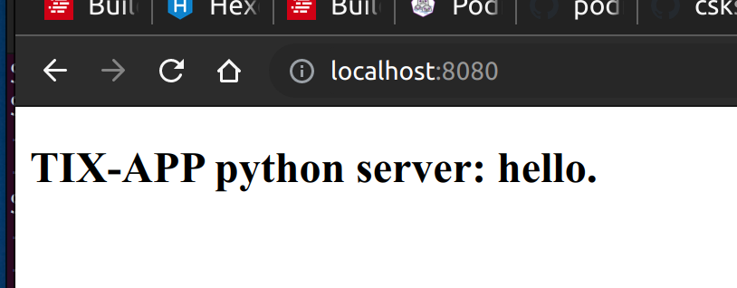

## tix-app-py

This app is a `Dockerized` Python helloworld server run using `podman`, and as such, can run on windows/linux/mac.

## Install Summary
```markdown 
* Generate an SSH key locally.
* Add it to your remote github account.
* Install github client.
* Install pip
# Install python
* Install podman
* build python container
* run python container
```

Install sublime text editor (optional)
```markdown
optional: install the sublime text editor for text editing:  
https://www.sublimetext.com/download
```

***

## Mac Install:

check if any ssh keys exist...  
```markdown
ls -lha ~/.ssh
```

if you see `id_rsa`, then an ssh key exists   
```markdown
-rw-------  1 blue blue 2.6K Aug  8  2020 id_rsa
-rw-------  1 blue blue  575 Aug  8  2020 id_rsa.pub
```

if you done't see `id_rsa`, then generate one...  

```markdown
ssh-keygen -t rsa -b 4096
```

copy the key
```markdown
pbcopy < ~/.ssh/id_rsa.pub
```

login to your github, add (ctrl-v) the ssh key to your account:  
https://github.com/settings/ssh/new


update package manager  
```markdown
 brew update
```

install python  
```markdown
 brew install python3
```

check python installation
```markdown
 python3 --version
```

install pip  

[install pip windows/linux/mac](https://www.makeuseof.com/tag/install-pip-for-python/)

install podman  

[install podman windows/mac](https://podman.io/getting-started/installation)


make a folder:

```markdown
mkdir ksu
cd ksu
```
clone the repo:

```markdown
GIT_SSH_COMMAND='ssh -i ~/.ssh/id_rsa' git clone git@github.com:csksu/tix-app-py.git  
```


build the container image...
```markdown
podman build -t hello-world-python .
```

run the container with the python server...
```markdown
podman run -p 3333:3333 hello-world-python:latest
```

open a browser and navigate to:

[http://localhost:3000](http://localhost:3000/)




kill the server...
```markdown 
ctrl-c
```

***

## Linux Install:
check if any ssh keys exist...
```markdown
ls -lha ~/.ssh
```

if you see `id_rsa`, then an ssh key exists
```markdown
-rw-------  1 blue blue 2.6K Aug  8  2020 id_rsa
-rw-------  1 blue blue  575 Aug  8  2020 id_rsa.pub
```

if you see don't see `id_rsa`, then generate one...

```markdown
ssh-keygen -t rsa -b 4096
```

copy the key
```markdown
xclip -selection clipboard < ~/.ssh/id_rsa.pub
```

login to your github, add (ctrl-v) the ssh key to your account:   

https://github.com/settings/ssh/new

install python
```markdown
sudo apt update
sudo apt install python3.6
```

install pip
```markdown
sudo apt install python3-pip

```

install podman:
```markdown
sudo apt -y install podman
```


build the container image...
```markdown
podman build -t hello-world-python .
```

run the container with the python server...
```markdown
podman run -p 3333:3333 hello-world-python:latest
```

open a browser and navigate to:

[http://localhost:3000](http://localhost:3000/)


kill the server...
```markdown 
ctrl-c
```

*** 

## Windows Install

check if any ssh keys exist...
```markdown
dir ~/.ssh

```

if you see `id_rsa`, then an ssh key exists
```
-rw-------  1 blue blue 2.6K Aug  8  2020 id_rsa
-rw-------  1 blue blue  575 Aug  8  2020 id_rsa.pub
```

if you see don't see `id_rsa`, then generate one...

```markdown
ssh-keygen -t rsa
```

see if the key was generated in the folder...
```markdown
dir ~/.ssh

```

copy the key  
```markdown
cat ~/.ssh/id_rsa.pub

```

login to your github, add (ctrl-v) the ssh key to your account:  
https://github.com/settings/ssh/new

install python  
[windows install python](https://www.python.org/downloads/windows/)

install pip  

[windows install pip](https://www.makeuseof.com/tag/install-pip-for-python/)

install podman  

[windows podman install](https://github.com/containers/podman/blob/main/docs/tutorials/podman-for-windows.md)

make a folder:

```markdown
mkdir ksu
cd ksu
```

clone the repo:

```markdown
GIT_SSH_COMMAND='ssh -i ~/.ssh/id_rsa' git clone git@github.com:csksu/tix-app-py.git  
```
build the container image...
```markdown
podman build -t hello-world-python .
```

run the container with the python server...
```markdown
podman run -p 3333:3333 hello-world-python:latest
```

open a browser and navigate to:

[http://localhost:3000](http://localhost:3000/)


kill the server...
```markdown 
ctrl-c
```


***

Ta Da! The end...

